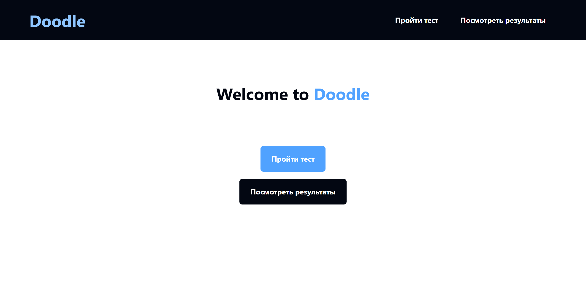
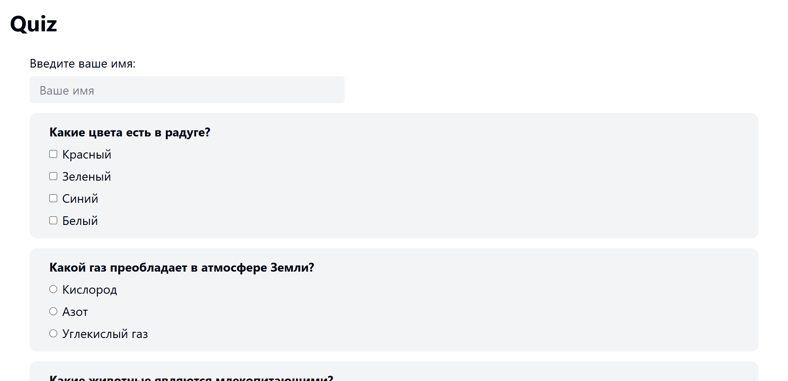
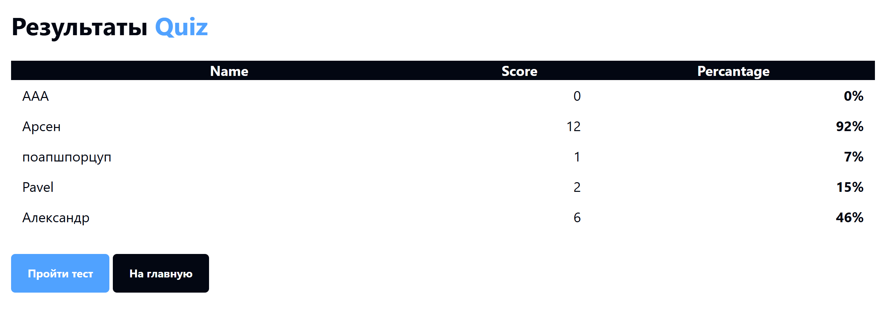

# Альтернативная аттестационная работа 01. Разработка веб-приложения для создания и прохождения тестов



## Инструкции по запуску проекта

1. Склонируйте репозиторий:
    ```bash
    git clone <repository-url>
    ```

2. Установите зависимости с помощью Composer:
    ```bash
    composer install
    ```
3. Настройте конфигурационные файлы.
4. Запустите сервер:
    ```bash
    php -S localhost:8000 -t public
    ```

## Краткое описание функционала приложения

В своей сути приложение представляет собой веб-сервис с маршрутизацией, поддерживающий различные HTTP-методы (GET, POST, PUT, PATCH, DELETE). Оно позволяет регистрировать маршруты и обрабатывать запросы с помощью callback-функций.

В качестве примера функционала приложения реализована возможность создания и прохождения тестов. Приложение позволяет создавать тесты, добавлять вопросы и варианты ответов к ним, а также проходить тесты и просматривать результаты.

## Примеры тестов

Пример вопроса теста в готовой `html` страничке
```html
<div class="bg-gray-100 py-4 px-8 rounded-xl">
    <h3 class="font-bold">Какие цвета есть в радуге?</h3>
    <div class="mt-2 flex flex-col gap-2">
        <div class="flex items-center gap-2">
            <input class="accent-gray-950" type="checkbox" id="red" name="answers[colors][]" value="red" checked="">
            <label for="red">Красный</label>
        </div>
        <div class="flex items-center gap-2">
            <input class="accent-gray-950" type="checkbox" id="orange" name="answers[colors][]" value="orange" checked="">
            <label for="orange">Зеленый</label>
        </div>
        <div class="flex items-center gap-2">
            <input class="accent-gray-950" type="checkbox" id="yellow" name="answers[colors][]" value="yellow" checked="">
            <label for="yellow">Синий</label>
        </div>
        <div class="flex items-center gap-2">
            <input class="accent-gray-950" type="checkbox" id="green" name="answers[colors][]" value="green">
            <label for="green">Белый</label>
        </div>
    </div>
</div>
```

## Структура базы данных или файла

Пример структуры JSON-файла `data/dashboard.json`:
```json5
[
    {"name":"Имя Пользователя","score":0,"percentage":0}
    //  ...
]
```

Пример структуры JSON-файла `data/questions.json`:
```json5
[
    {
        "id": "music",
        "question": "Кто написал симфонию № 9 'Ода к радости'?",
        "type": "radio",
        "answers": [
            { "id": "mozart", "text": "Моцарт", "correct": false },
            { "id": "beethoven", "text": "Бетховен", "correct": true },
            { "id": "bach", "text": "Бах", "correct": false }
        ]
    }
    //  ...
]
```

## Скриншоты работы приложения


